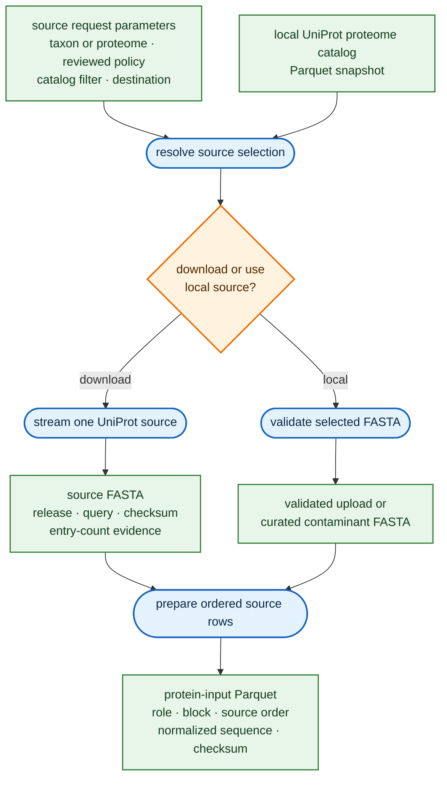
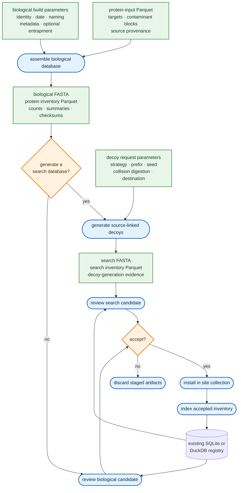
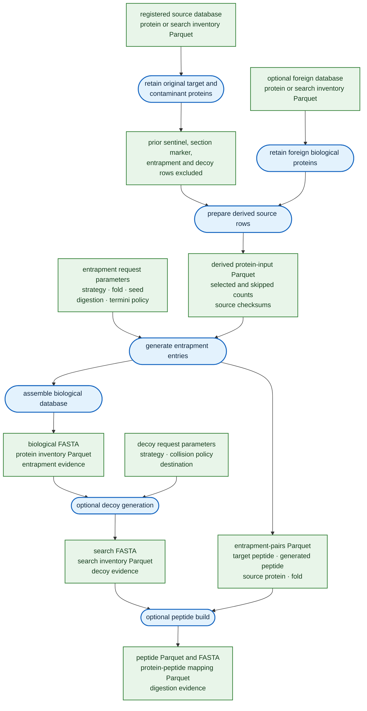
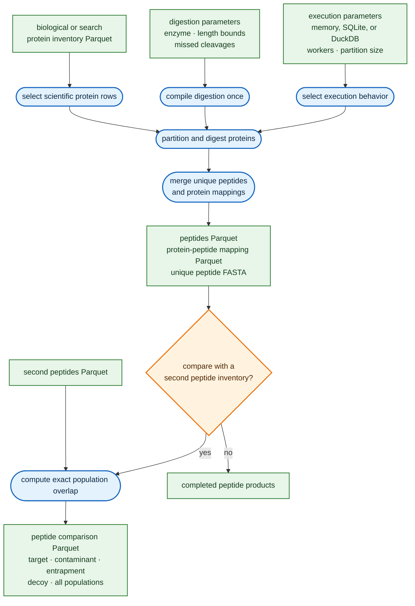
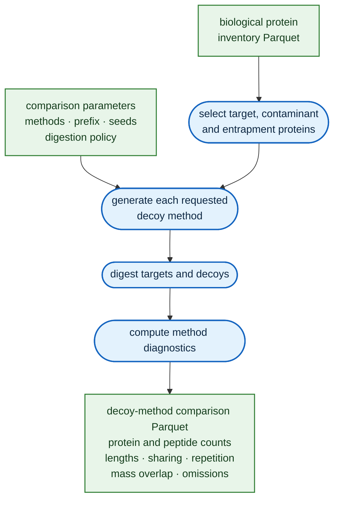
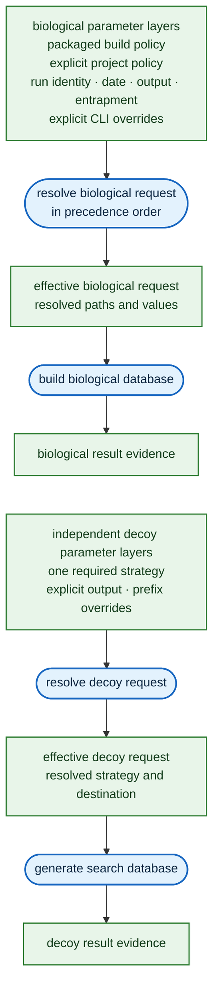
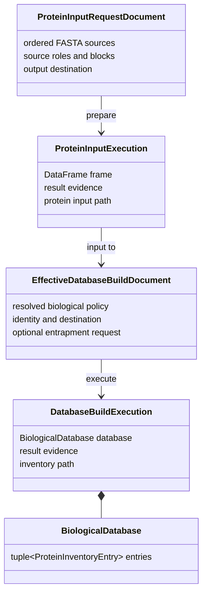
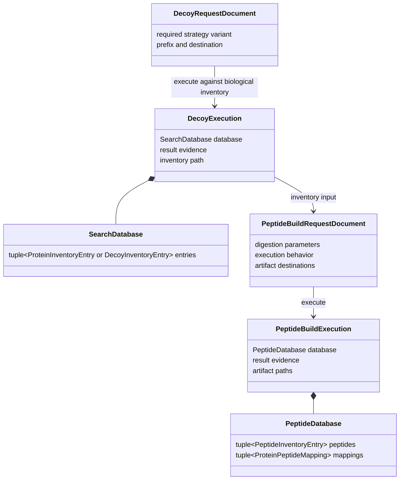

# Protein and peptide database workflows

The workflows are the design. Configuration documents, Python classes, CLI commands, and file
formats exist to make these use cases reproducible. In every workflow figure, rounded blue nodes
are computations, green rectangles are data, cylinders are durable registries, and amber diamonds
are user or application decisions. Every figure flows from top to bottom.

## Use cases

### Acquire or select protein sources



*Figure 1. Acquire or select inputs and prepare one canonical protein source inventory.*

The curator selects a UniProt proteome, an uploaded FASTA, or application-curated sources. A
UniProt download is one acquisition operation: it does not build, add decoys, install, or index.
`prepare` then normalizes the selected target, contaminant, and optional foreign rows once and
records their order and origin in `protein-input.parquet`.

### Build a routine search database



*Figure 2. Build biological entries once, then optionally generate and review a search database.*

`protein-fasta build` ends with a decoy-free biological database. `protein-fasta decoy` is the
subsequent operation and can be rerun with reverse, shuffle, or DecoyPYrat parameters without
repeating source preparation, contaminants, or entrapment. Candidate review is read-only.
Installation remains a `fasta_gen` site mutation, followed by an explicit inventory-indexing step.

### Derive an entrapment database



*Figure 3. Derive clean biological sources, add entrapment, and only then generate decoys.*

This is the former `fasta_gen` derived-entrapment use case at its real boundary. The source filter
keeps only existing target and contaminant proteins, exactly matching the former application
behavior. A foreign source is filtered the same way and relabeled as foreign input. New
entrapment entries and pair evidence are generated during the biological build; decoys remain a
separate later operation over the completed biological inventory.

### Build and compare peptide databases



*Figure 4. Build canonical peptide artifacts and optionally compare exact peptide populations.*

The peptide workflow preserves protein order, identity, and scientific kind. Memory, SQLite, and
DuckDB are interchangeable execution behaviors behind one result contract; they do not change
the peptide or mapping bytes. The canonical handoffs are Parquet. The FASTA is a unique-peptide
search artifact, while TSV is reserved for explicit compatibility export at an application edge.

### Compare decoy methods



*Figure 5. Compare selectable decoy methods from the same biological inventory.*

`decoy-report` reuses one biological input and reports the scientific consequences of each
requested method. It does not publish a search database, mutate a registry, or combine
entrapment-overlap analysis with decoy comparison.

## Requirements derived from the use cases

1. Source acquisition, source preparation, biological assembly, decoy generation, candidate
   review, installation, indexing, peptide construction, and comparison are separate operations.
2. Biological build never generates decoys. Decoy requests always name exactly one strategy and
   consume a completed biological inventory.
3. A canonical protein-input Parquet is the only file-based input to biological build. It carries
   source order, role, contaminant block, raw header, normalized sequence, and normalization
   evidence.
4. Biological and search databases each have one canonical frozen entry tuple. FASTA and Parquet
   are projections of that tuple rather than separately accumulated products.
5. Result manifests checksum every artifact they own. Multi-file products are staged, published
   together, and committed by publishing the result manifest last.
6. Every workflow is callable through Python and the CLI. The CLI loads serialized request
   documents and invokes the same resolver and execution function as a Python caller.
7. Parquet is the tabular workflow exchange format. JSON serializes parameters and result
   evidence. FASTA is retained where a search engine or protein-source boundary requires it.
8. Storage documents are passive Pydantic models. Frozen runtime types own computation; Polars
   frames and filesystem paths remain at adapters and workflow boundaries.

## Command boundaries

| Command | One responsibility | Primary products |
| --- | --- | --- |
| `uniprot-catalog` | Synchronize a checksummed local proteome catalog | catalog Parquet + sync evidence |
| `uniprot-proteomes` | Filter a local catalog without network access | inspection table |
| `uniprot-download` | Acquire one selected UniProt source | FASTA + acquisition evidence |
| `prepare` | Normalize ordered FASTA sources and roles | protein-input Parquet |
| `derive-input` | Filter registered biological/search inventories for a new entrapment build | protein-input Parquet + skipped counts |
| `build` | Assemble targets, contaminants, and optional entrapment | biological FASTA + protein inventory Parquet |
| `decoy` | Generate one search database from a biological inventory | search FASTA + search inventory Parquet |
| `candidate` | Compare an unregistered inventory with an existing registry | candidate comparison Parquet |
| `index-inventory` | Index one accepted canonical inventory directly | SQLite or DuckDB registry update |
| `index` | Adapt a legacy FASTA directory into the registry | SQLite or DuckDB registry update |
| `peptides` | Digest one biological or search inventory | peptides and mapping Parquet + peptide FASTA |
| `pepcompare` | Compare two canonical peptide inventories | comparison Parquet |
| `decoy-report` | Compare scientific diagnostics for requested decoy methods | decoy comparison Parquet |

## Parameter precedence



*Figure 6. Resolve biological-build and decoy parameters independently.*

Biological precedence is `packaged policy < explicit policy < run parameters < explicitly
supplied CLI values`. The effective request is written before sequence work begins. Decoy
resolution is independent: neither the build profile nor the biological request contains a decoy
default.

## Programmatic composition

The serialized documents are optional at a Python boundary. `fasta_gen` or another caller can
construct the same Pydantic request objects directly, resolve them once, and pass the returned
execution artifact to the next API:

```python
from pathlib import Path

from protein_fasta.database_build import resolve_database_build, run_database_build
from protein_fasta.decoy_database import resolve_decoy_request, run_decoy_generation
from protein_fasta.documents import (
    load_builtin_database_build_profile,
    load_database_build_request,
    load_decoy_request,
)
from protein_fasta.peptide_workflow import (
    resolve_peptide_build_request,
    run_peptide_build,
)
from protein_fasta.documents import load_peptide_build_request

protein_input = Path("protein-input.parquet")
build_path = Path("biological-build.json")
build = resolve_database_build(
    load_builtin_database_build_profile(),
    load_database_build_request(build_path),
    profile_base=build_path.parent,
    request_base=build_path.parent,
)
biological = run_database_build(protein_input, build)

decoy_path = Path("reverse-decoys.json")
decoy = resolve_decoy_request(
    load_decoy_request(decoy_path),
    request_base=decoy_path.parent,
)
search = run_decoy_generation(biological.inventory_path, decoy)

peptide_path = Path("peptides.json")
peptide = resolve_peptide_build_request(
    load_peptide_build_request(peptide_path),
    request_base=peptide_path.parent,
)
peptides = run_peptide_build(search.search_inventory_path, peptide)
```

The chain passes paths when durable replay is desired. At the computation boundary, the
equivalent values are frozen `BiologicalDatabase`, `SearchDatabase`, and `PeptideDatabase`
instances containing tuples of typed entries. Polars frames are returned by artifact-reading and
report APIs; they are not passed into backend-free sequence computation.

## API and storage types



*Figure 7. Source preparation and biological build types.*

The source document represents authored parameters. Preparation returns a checksummed Parquet
handoff. The effective build document is replayable, while `BiologicalDatabase` is the immutable
runtime product from which both FASTA and inventory are projected.



*Figure 8. Search-database and peptide workflow types.*

The decoy request is a discriminated storage union for reverse, shuffle, or DecoyPYrat. Resolution
constructs one behavior-owning runtime generation. Peptide execution similarly selects memory,
SQLite, or DuckDB once; every behavior returns the same canonical `PeptideDatabase`.
