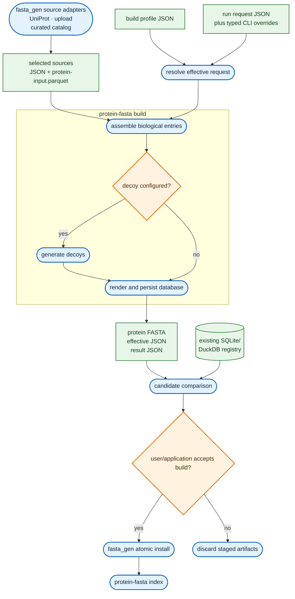
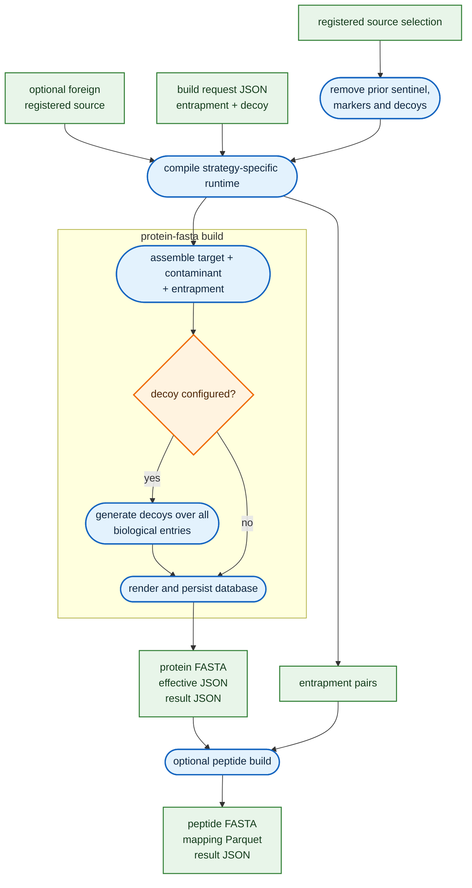
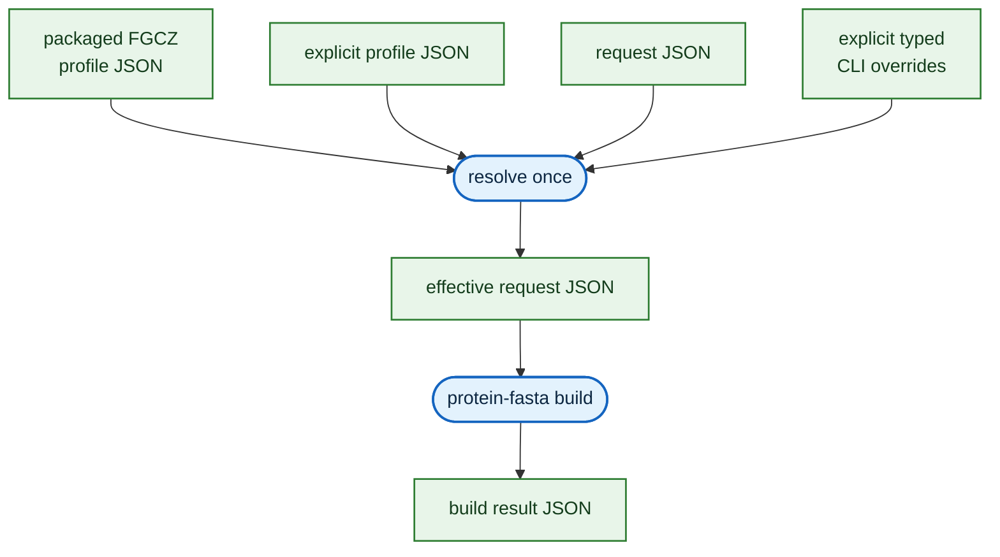
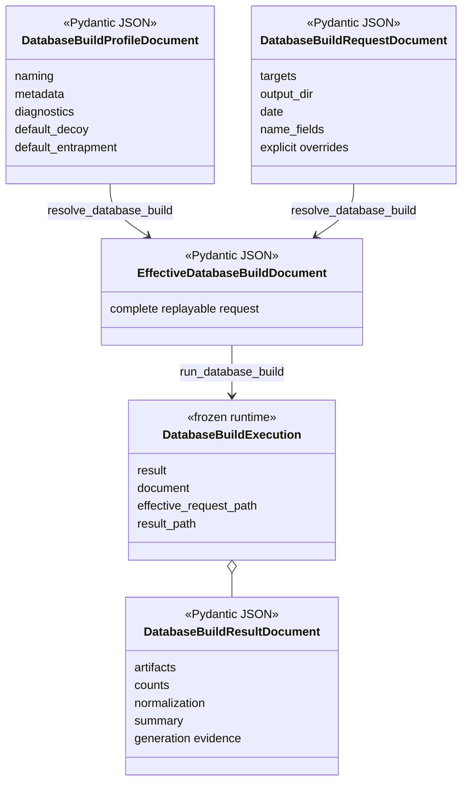

# Build workflows

The use cases come first. Configuration documents, runtime classes, CLI commands, and storage
formats exist to make these workflows reproducible from either Python or the shell.

Rounded blue nodes are computations. Green rectangles are exchanged data. Cylinders are durable
stores, and amber diamonds are decisions. All diagrams flow top to bottom for portrait reading.

## Routine protein database build



`protein-fasta build` owns the complete database build, including configured decoy generation.
Biological assembly and decoy generation remain separate internal computations with separate
evidence and tests. Installation is intentionally outside the build because it mutates a
site-owned collection.

## Entrapment database build



Entrapment is a biological-source stage, not a decoy strategy. Entrapment entries join the target
space first; when decoys are configured, `build` generates counterparts for targets,
contaminants, and entrapments together.

## Configuration precedence



Precedence is `packaged profile < explicit profile < request < explicitly supplied CLI option`.
The effective document contains resolved paths and is written before FASTA processing begins.
An explicit request value of `"decoy": null`, or CLI `--decoy none`, disables profile decoys.

## CLI workflow

The request owns per-run facts. The profile owns reusable defaults.

```bash
protein-fasta build "$WORK/request.json" \
  --profile "$WORK/fgcz.json" \
  --date 2026-08-28 \
  --decoy reverse
head -n 3 "$WORK/out/p42261_db1_human_d_20260828.fasta"
```

The command writes three primary files beside one another:

- the protein FASTA;
- `*.fasta.effective.json`, written before sequence computation; and
- `*.fasta.result.json`, containing the effective request, checksummed artifacts, counts,
  normalization, sequence and amino-acid summaries, and decoy/entrapment evidence.

## Programmatic workflow

The Python API composes the same boundaries as the CLI:

```python
from pathlib import Path

from protein_fasta.database_build import resolve_database_build, run_database_build
from protein_fasta.documents import (
    load_database_build_profile,
    load_database_build_request,
)

profile_path = Path("fgcz.json")
request_path = Path("request.json")
profile = load_database_build_profile(profile_path)
request = load_database_build_request(request_path)
effective = resolve_database_build(
    profile,
    request,
    profile_base=profile_path.parent,
    request_base=request_path.parent,
)
execution = run_database_build(effective)

print(execution.result.path)
print(execution.result_path)
```

`fasta_gen` can construct the two Pydantic documents directly instead of loading files, call the
same resolver, and pass the effective document to `run_database_build()`. It receives a frozen
`DatabaseBuildExecution`; its `document` is the same typed result serialized by the CLI.

## Build classes and documents



Pydantic classes are storage and exchange documents. They validate and serialize; sequence work
remains in the database-build computation. The low-level build receives either one decoy
specification or `None`; it has no separate boolean that can disagree with the configured stage.
